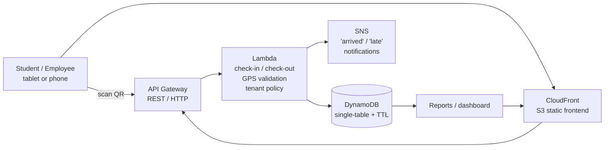

# QR Presence — Serverless Attendance & Presence System

A multi-tenant, serverless attendance system with a single engine that serves two verticals: **schools** (student attendance + parent notifications) and **workplaces** (employee check-in/out, work hours, and reports — municipalities, SMEs).

The core mechanic is a QR code at the door: scan to register presence. One deployment, many tenants, each with its own policy.

---

## The problem

- **Schools**: teachers track attendance on paper or WhatsApp groups; parents don't know if their child arrived safely.
- **Workplaces** (municipalities, SMEs): manual check-in, no reliable hours, lateness, or attendance records.
- The missing layer in many places is the operational software that runs on top of already-deployed hardware and connectivity — tablets in classrooms, fiber and wireless links in public buildings. This project is that layer.

## Why serverless

- **~$1/month at real scale**: Lambda + DynamoDB at portfolio/pilot volumes cost cents; the only fixed cost is a hosted zone (Route 53 ~$0.50/mo).
- **No servers to patch or babysit**: ideal for a solo developer shipping a pilot to one school or one municipality.
- **Adaptive capacity**: cheap at zero traffic, still fine if a tenant grows.

---

## Features

### Single engine, two verticals

| Capability | School (students) | Workplace (municipality/SME) |
|---|---|---|
| QR check-in at the door | ✅ | ✅ |
| Check-out / hours worked | — | ✅ |
| Parent notification ("arrived" / "missing") | ✅ | — |
| Lateness, early exit, overtime | — | ✅ |
| Reports by section / department | ✅ | ✅ |
| Leave / justification records | ✅ | ✅ |

### Security & anti-fraud

- **GPS radius validation** — the check-in Lambda rejects events outside the workplace perimeter.
- **Rotating QR codes** — unique, frequently rotated codes so a code cannot be shared or replayed.
- **Optional photo capture** on check-in (post-MVP).
- **Least-privilege IAM** — functions can only touch what they need; no long-lived credentials stored.

### Multi-tenancy

One deployment, N tenants (schools, alcaldías, companies). Tenant configuration defines:
- Work schedule / school hours
- Notification channels (parents vs. HR)
- Which capabilities are enabled (check-out, reports, justifications)

---

## Architecture



- **Ingestion & validation**: API Gateway → Lambda. The Lambda validates GPS, applies the tenant policy, and writes the event.
- **Storage**: DynamoDB single-table design (tenants, participants, events, reports) with TTL for transient data.
- **Notifications**: SNS pushes "arrived" / "not arrived" to parents or HR.
- **Delivery**: S3 + CloudFront for the static dashboard, with a custom domain via Route 53 and a free ACM certificate.
- **Observability**: CloudWatch logs, metric filters, and a cost/error dashboard.
- **Infrastructure as Code**: Terraform (see roadmap — being built as part of this project).
- **CI/CD**: GitHub Actions with **OIDC federation** — `terraform plan` on PRs, `apply` on main.

---

## Repository layout (planned)

```
qr-presence/
├── README.md
├── infra/                  # Terraform — VPC-less serverless stack
│   ├── modules/            #   api-gateway, lambda, dynamodb, sns, static
│   └── environments/       #   dev / prod
├── app/                    # Application code
│   ├── api/                #   Lambda handlers (check-in, check-out, reports)
│   ├── web/                #   Frontend (check-in UI + dashboard)
│   └── tests/
└── docs/                   # Architecture decisions, tenant onboarding
```

---

## Cost estimate

| Component | Monthly cost (pilot scale) |
|---|---|
| Lambda (22k events/mo, a small workplace) | ~$0.00 |
| DynamoDB on-demand | ~$0.01 |
| API Gateway (HTTP API) | ~$0.01 |
| S3 + CloudFront | ~$0.00 (within always-free transfer) |
| Route 53 hosted zone | ~$0.50 |
| **Total** | **≈ $0.50–1.00/month** |

Note: the "always free" tiers of Lambda, DynamoDB, S3, and CloudFront are permanent, not part of the 12-month trial — they apply to accounts active for years.

---

## Roadmap

- [ ] **MVP (workplace vertical)**: QR check-in + check-out + GPS validation + basic reports
- [ ] School vertical: parent notifications + justifications
- [ ] Tenant onboarding / per-tenant policy configuration
- [ ] Admin dashboard (present members, lateness, hours)
- [ ] Optional photo capture on check-in
- [ ] Terraform infra + GitHub Actions CI/CD (OIDC)
- [ ] CloudWatch dashboard + budget alerts

---

## Skills this project showcases

- **Serverless architecture** (API Gateway, Lambda, DynamoDB, SNS, S3, CloudFront, Route 53)
- **DynamoDB single-table design**
- **IaC with Terraform** (modules, environments, remote state)
- **CI/CD with GitHub Actions + OIDC federation** (no long-lived cloud credentials)
- **Security by design**: least privilege IAM, rotating QR, GPS-bound checks, no secrets in code
- **Observability**: structured logging, metrics, alarms
- **Multi-tenant product thinking**: one engine, two verticals, per-tenant policy

---

## Status

**Early development.** The README defines the product and architecture; the Terraform infrastructure and application code are being built.